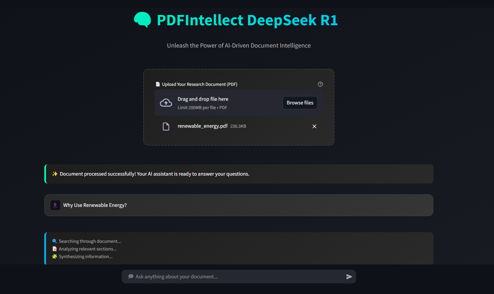
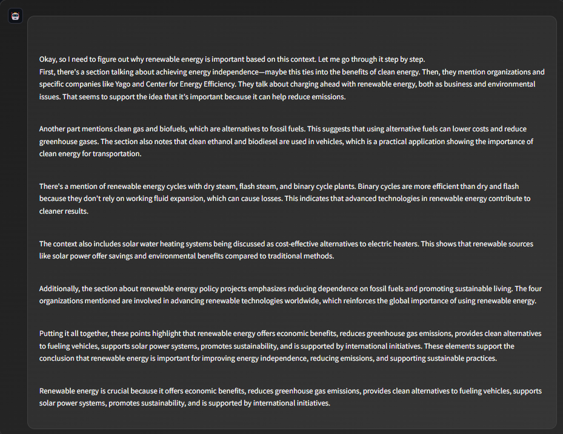
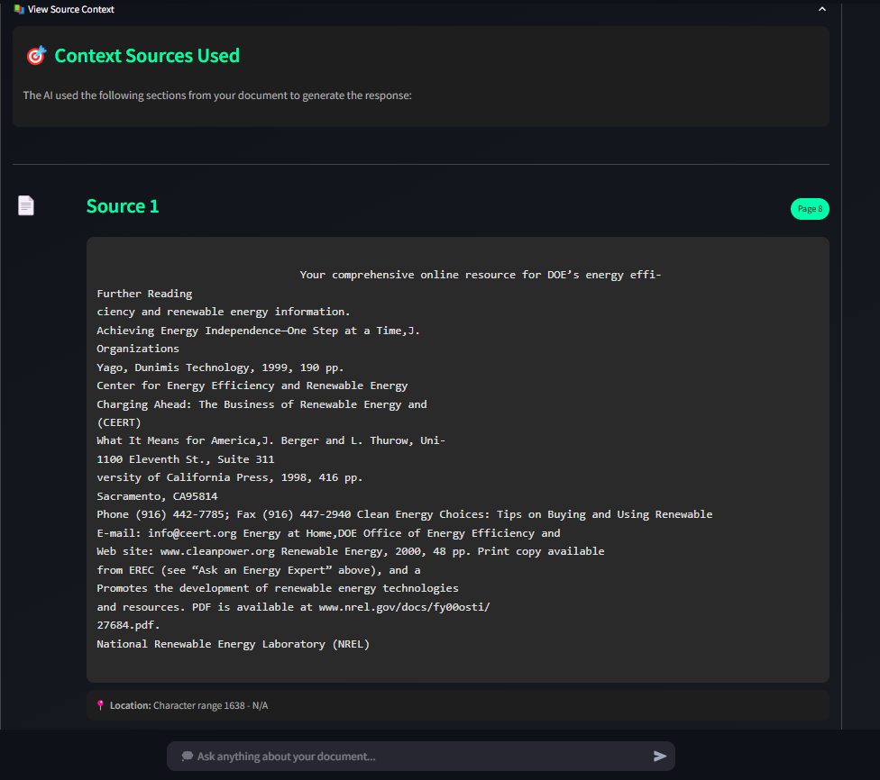

# **Local RAG using Ollama with DeepSeek-R1:1.5b Model** 🧠






## **Unlock the Power of Local AI-Powered Document Analysis!** 🌟

Welcome to the **Local RAG (Retrieval-Augmented Generation)** project, where cutting-edge AI meets seamless document processing! This repository leverages the **DeepSeek-R1:1.5b model** through **Ollama** to deliver a powerful, local, and intuitive system for document analysis, semantic search, and AI-powered Q&A. Whether you're a researcher, developer, or AI enthusiast, this tool is designed to make your document interactions smarter, faster, and more efficient.

---

## ✨ **Why Choose This Project?**

- **Local Processing**: No cloud dependencies—everything runs on your machine! 💻
- **AI-Powered Insights**: Get accurate answers with **source references** and **page numbers**. 📑
- **Modern UI**: A sleek, user-friendly interface powered by **Streamlit**. 🎨
- **Optimized Performance**: Fast, efficient, and designed for real-world use. ⚡

---

## 🎯 **Key Features**

- **📚 PDF Document Processing**: Extract and analyze text from PDFs effortlessly.
- **🔍 Semantic Search**: Find relevant content with high precision.
- **🤖 AI-Powered Q&A**: Ask questions and get answers with **source citations**.
- **📑 Page-Level References**: Track answers back to specific pages in your document.
- **💻 Local Execution**: No need for internet or cloud services—everything runs locally.
- **🚀 Fast & Efficient**: Optimized for quick response times and low memory usage.

---

## 🛠️ **Getting Started**

### **Prerequisites**

- **Python 3.12**
- **Conda** (for environment management)
- **Ollama** with the **DeepSeek-R1:1.5b** and **embedding model: nomic-embed-text:latest**

---

### **Installation**

1. **Clone the Repository**:

   ```bash
   git clone https://github.com/Rizwankaka/local_deepseekr1_rag.git
   cd local_deepseekr1_rag
   ```
2. **Set Up Conda Environment**:

   ```bash
   conda create -p venv python=3.12
   conda activate venv/
   ```
3. **Install Requirements**:

   ```bash
   pip install -r requirements.txt
   ```

---

## 🚀 **Running the Application**

1. **Start Ollama Server**:
   Ensure Ollama is running with the DeepSeek-R1:1.5b model loaded.
2. **Launch the Streamlit App**:

   ```bash
   streamlit run rag_deepseekr1.py
   ```
3. **Upload a PDF** and start asking questions! 🤖

---

## 💡 **How It Works**

1. **Upload a PDF**: The system processes your document, extracting text and generating embeddings.
2. **Ask Questions**: The AI retrieves relevant context and provides answers with **page-level references**.
3. **Explore Insights**: Dive into the source material and verify answers with ease.

---

## 🎨 **Features in Detail**

### **Document Processing**

- Efficient PDF text extraction.
- Smart text chunking for optimal context retrieval.
- Semantic embedding generation for accurate search.

### **Context Retrieval**

- High-precision semantic search.
- Page number tracking for easy reference.
- Source verification for reliable answers.

### **User Interface**

- Modern, responsive design.
- Clear source references and page number indicators.
- Interactive context viewing for deeper insights.

---

## 🔧 **Technical Details**

### **RAG Pipeline**

1. **Document Ingestion**: Upload and process PDFs.
2. **Text Chunking**: Break down text into manageable chunks.
3. **Embedding Generation**: Create semantic embeddings for search.
4. **Semantic Search**: Retrieve relevant context.
5. **Response Generation**: Generate answers with source references.

### **Model Specifications**

- **Base Model**: DeepSeek-R1:1.5b
- **Embedding Model**:ollama embedding: nomic-embed-text:latest
- **Context Window**: 1000 tokens
- **Chunk Overlap**: 200 tokens

---

## 📊 **Performance Metrics**

- **Response Generation**: 2-3 seconds
- **Context Retrieval**: <1 second
- **Document Processing**: ~1-2 seconds per page
- **Memory Footprint**: ~2GB for model

---

## 🤝 **Contributing**

We welcome contributions! If you'd like to improve this project, please:

1. Fork the repository.
2. Create a new branch.
3. Submit a pull request.

---


## 🙏 **Acknowledgments**

- **Ollama Team** for the local model deployment.
- **DeepSeek Team** for the excellent model.
- **Streamlit Team** for the intuitive UI framework.

---

## 🔗 **Contact**

For questions, feedback, or support, please [open an issue](https://github.com/your-username/local-rag-ollama-deepseek/issues) in the repository.

---

**Made with ❤️ by Rizwan Rizwan**
🌟 **Star this repo if you find it useful!** 🌟
